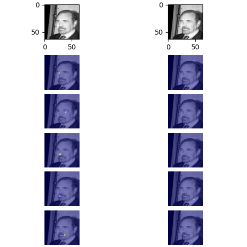
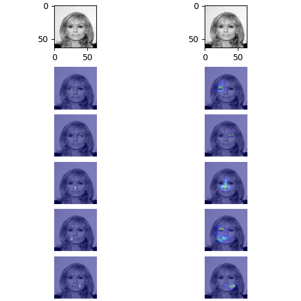
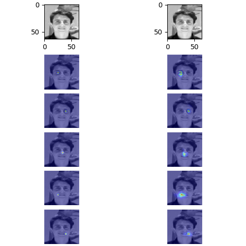
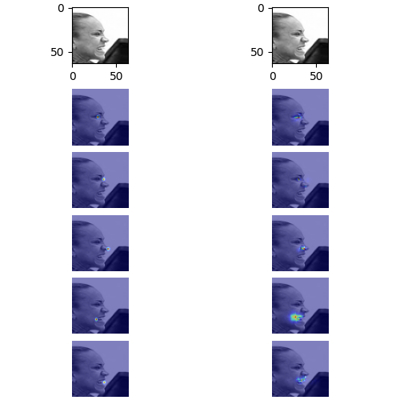
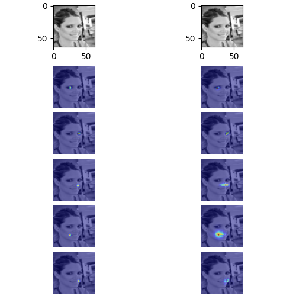
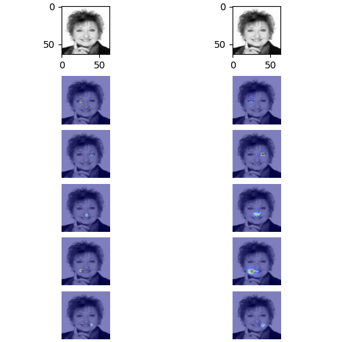
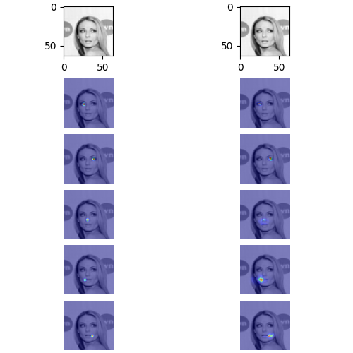
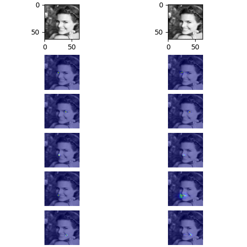
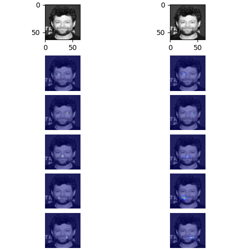
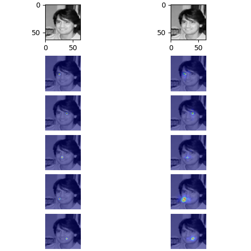

## What is this ?

While working on porting code [here](https://github.com/AliaksandrSiarohin/first-order-model) from  to JAX: 
I was curious to know whether the keypoint exctractor as is, could be trained on the [CelebA dataset]() to infer keypoints on human faces

Turns out the answer is yes

Evals

## How to run
